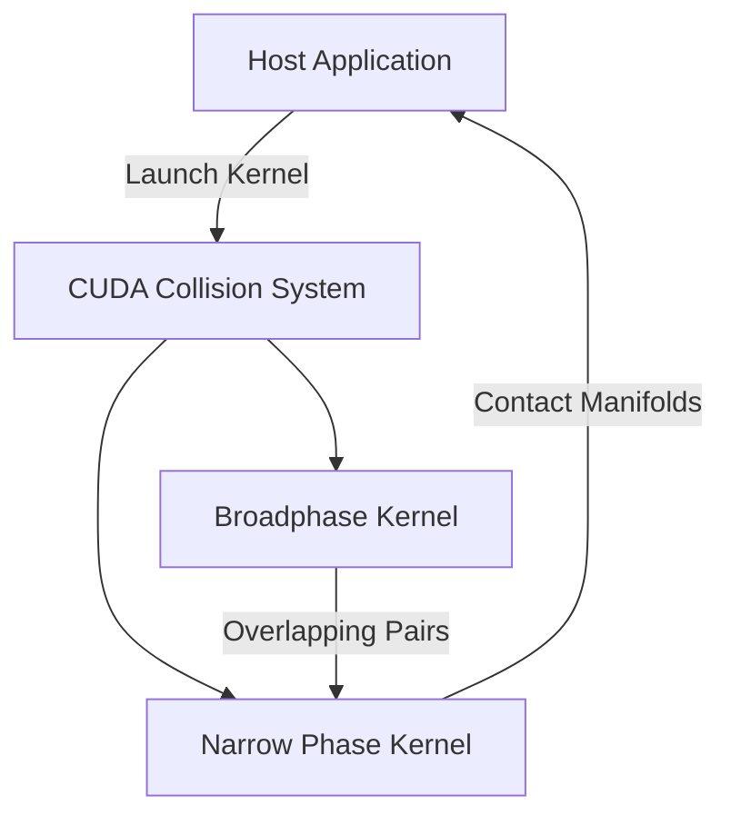

# Bullet Physics Engine Collision Detection CUDA Acceleration Analysis

## 1. Project Overview

This document provides a comprehensive analysis of the current Bullet physics engine collision detection implementation and proposes a complete CUDA-based rewrite for GPU acceleration. The goal is to significantly improve performance for large-scale physics simulations while maintaining compatibility with existing Chrono codebase.

## 2. Current Implementation Analysis

### 2.1 Core Architecture

The current implementation uses a two-phase collision detection approach:

1. **Broadphase**: Uses Dynamic Bounding Volume Tree (DBVT) in `cbtDbvtBroadphase`
2. **Narrow Phase**: Uses various collision algorithms dispatched by `cbtCollisionDispatcher`

### 2.2 Key Components

#### Broadphase Collision Detection (`cbtDbvtBroadphase`)

- **Data Structure**: Dynamic Bounding Volume Tree (DBVT) with two sets (dynamic and fixed)
- **Algorithm**: Hierarchical AABB tree with incremental updates
- **Key Operations**:
  - `createProxy()`: Inserts new objects into the tree
  - `setAabb()`: Updates object bounds with collision detection
  - `collide()`: Performs tree-traversal for overlap detection
  - `calculateOverlappingPairs()`: Main broadphase entry point

#### Narrow Phase Collision Detection (`cbtCollisionDispatcher`)

- **Algorithm**: Dispatches specific collision algorithms based on shape types
- **Key Operations**:
  - `defaultNearCallback()`: Processes overlapping pairs from broadphase
  - `findAlgorithm()`: Selects appropriate collision algorithm
  - `dispatchAllCollisionPairs()`: Main narrow phase entry point

### 2.3 Performance Bottlenecks

1. **Sequential Processing**: Both broadphase and narrow phase are primarily single-threaded
2. **Memory Bandwidth**: Frequent cache misses due to pointer-chasing in tree structures
3. **Tree Traversal**: DBVT traversal is inherently sequential and difficult to parallelize
4. **Algorithm Dispatch Overhead**: Virtual function calls and dynamic dispatch in narrow phase
5. **Data Locality**: Poor cache utilization due to scattered memory access patterns

## 3. CUDA Rewrite Design

### 3.1 Overall Architecture



### 3.2 Parallelization Strategy

#### Broadphase Parallelization

- **Grid-based Approach**: Replace DBVT with uniform grid for better GPU parallelism
- **Spatial Hashing**: Use 3D grid cells with hash-based indexing
- **Parallel AABB Tests**: Each thread processes multiple object pairs

#### Narrow Phase Parallelization

- **Shape-type Specialization**: Separate kernels for different shape combinations
- **Batch Processing**: Process multiple contact pairs per thread
- **Prefix Sum**: Efficiently compact valid contact points

### 3.3 Memory Optimization

#### Data Structures

```cpp
// GPU-friendly AABB structure
struct AABB {
    float3 min;
    float3 max;
    int objectId;
    int shapeType;
};

// Compact contact point structure
struct ContactPoint {
    float3 positionOnA;
    float3 positionOnB;
    float3 normal;
    float distance;
};
```

#### Memory Layout

- **SoA (Structure of Arrays)**: For better memory coalescing
- **Padded Structures**: Align to cache lines
- **Texture Memory**: For read-only geometry data
- **Shared Memory**: For intermediate results

### 3.4 Integration with Existing Code


## 4. Development Plan

### 4.1 Phase 1: Research and Design

- [x] Analyze current Bullet implementation
- [ ] Benchmark current performance
- [ ] Design GPU data structures
- [ ] Create CUDA algorithm prototypes

### 4.2 Phase 2: Core Implementation

- [ ] Implement GPU broadphase detection
- [ ] Implement GPU narrow phase algorithms
- [ ] Create memory management system
- [ ] Develop CUDA-C++ integration layer

### 4.3 Phase 3: Optimization

- [ ] Profile and optimize kernels
- [ ] Implement memory pooling
- [ ] Add multi-GPU support
- [ ] Optimize data transfer

### 4.4 Phase 4: Integration and Testing

- [ ] Integrate with Chrono collision system
- [ ] Implement fallback mechanism
- [ ] Develop comprehensive test suite
- [ ] Performance benchmarking

## 5. Implementation Steps

### 5.1 Step 1: GPU Data Structures

```cpp
// cuda_collision_types.h
#pragma once

#include <cuda_runtime.h>
#include <vector_types.h>

struct GPU_AABB {
    float3 min;
    float3 max;
    int objectId;
    int shapeType;
    int collisionGroup;
    int collisionMask;
};

struct GPU_ContactPoint {
    float3 positionOnA;
    float3 positionOnB;
    float3 normal;
    float distance;
    int shapeIndexA;
    int shapeIndexB;
};

struct GPU_ContactManifold {
    int objectIdA;
    int objectIdB;
    int contactCount;
    int contactOffset;  // Offset in global contact array
};
```

### 5.2 Step 2: Broadphase Kernel

```cpp
// cuda_broadphase.cu
#include "cuda_collision_types.h"
#include <cooperative_groups.h>

namespace cg = cooperative_groups;

__global__ void broadphase_kernel(
    const GPU_AABB* __restrict__ aabbs,
    int numObjects,
    GPU_ContactManifold* __restrict__ manifolds,
    int* __restrict__ manifoldCount,
    float3 gridSize,
    float cellSize) {
    
    // Thread block for processing grid cells
    cg::thread_block block = cg::this_thread_block();
    
    // Calculate grid cell for this block
    int3 gridDim = make_int3(
        static_cast<int>(ceil(gridSize.x / cellSize)),
        static_cast<int>(ceil(gridSize.y / cellSize)),
        static_cast<int>(ceil(gridSize.z / cellSize)));
    
    // Process objects in this grid cell
    for (int i = block.thread_rank(); i < numObjects; i += block.size()) {
        // Calculate grid cell indices for this AABB
        int3 cellMin = make_int3(
            static_cast<int>(floor(aabbs[i].min.x / cellSize)),
            static_cast<int>(floor(aabbs[i].min.y / cellSize)),
            static_cast<int>(floor(aabbs[i].min.z / cellSize)));
        
        int3 cellMax = make_int3(
            static_cast<int>(floor(aabbs[i].max.x / cellSize)),
            static_cast<int>(floor(aabbs[i].max.y / cellSize)),
            static_cast<int>(floor(aabbs[i].max.z / cellSize)));
        
        // Check neighboring cells for potential collisions
        for (int x = cellMin.x; x <= cellMax.x; x++) {
            for (int y = cellMin.y; y <= cellMax.y; y++) {
                for (int z = cellMin.z; z <= cellMax.z; z++) {
                    // Get cell index
                    int cellIndex = x + y * gridDim.x + z * gridDim.x * gridDim.y;
                    
                    // Check all objects in this cell
                    for (int j = 0; j < numObjects; j++) {
                        if (i != j && 
                            (aabbs[i].collisionGroup & aabbs[j].collisionMask) &&
                            (aabbs[j].collisionGroup & aabbs[i].collisionMask)) {
                            
                            // AABB overlap test
                            if (aabbs[i].max.x >= aabbs[j].min.x &&
                                aabbs[i].min.x <= aabbs[j].max.x &&
                                aabbs[i].max.y >= aabbs[j].min.y &&
                                aabbs[i].min.y <= aabbs[j].max.y &&
                                aabbs[i].max.z >= aabbs[j].min.z &&
                                aabbs[i].min.z <= aabbs[j].max.z) {
                            
                            // Add to potential contact manifold
                            int idx = atomicAdd(manifoldCount, 1);
                            if (idx < MAX_MANIFOLDS) {
                                manifolds[idx].objectIdA = min(aabbs[i].objectId, aabbs[j].objectId);
                                manifolds[idx].objectIdB = max(aabbs[i].objectId, aabbs[j].objectId);
                                manifolds[idx].contactCount = 0;
                                manifolds[idx].contactOffset = 0;
                            }
                        }
                    }
                }
            }
        }
    }
}
```

### 5.3 Step 3: Narrow Phase Kernel

```cpp
// cuda_narrowphase.cu
#include "cuda_collision_types.h"
#include "cuda_shapes.h"

__device__ bool sphere_sphere_collision(
    const SphereShape& sphereA,
    const SphereShape& sphereB,
    const float3& posA,
    const float3& posB,
    GPU_ContactPoint& contact) {
    
    float3 delta = posB - posA;
    float distanceSqr = dot(delta, delta);
    float radiusSum = sphereA.radius + sphereB.radius;
    
    if (distanceSqr > radiusSum * radiusSum) {
        return false; // No collision
    }
    
    float distance = sqrtf(distanceSqr);
    if (distance < 1e-6f) {
        // Objects are at same position, use arbitrary normal
        contact.normal = make_float3(0.0f, 1.0f, 0.0f);
    } else {
        contact.normal = delta / distance;
    }
    
    contact.positionOnA = posA + contact.normal * sphereA.radius;
    contact.positionOnB = posB - contact.normal * sphereB.radius;
    contact.distance = radiusSum - distance;
    
    return true;
}

__global__ void narrowphase_kernel(
    const GPU_ContactManifold* __restrict__ manifolds,
    int numManifolds,
    GPU_ContactPoint* __restrict__ contacts,
    int* __restrict__ contactCounts,
    const void* __restrict__ shapeData,
    const float3* __restrict__ positions,
    const float3* __restrict__ rotations) {
    
    int idx = blockIdx.x * blockDim.x + threadIdx.x;
    if (idx >= numManifolds) return;
    
    const GPU_ContactManifold& manifold = manifolds[idx];
    
    // Get object data
    int objA = manifold.objectIdA;
    int objB = manifold.objectIdB;
    
    // Get shapes (simplified - actual implementation would use proper indexing)
    const ShapeHeader* headerA = reinterpret_cast<const ShapeHeader*>(shapeData) + objA;
    const ShapeHeader* headerB = reinterpret_cast<const ShapeHeader*>(shapeData) + objB;
    
    // Get transforms
    float3 posA = positions[objA];
    float3 posB = positions[objB];
    
    // Dispatch based on shape types
    if (headerA->type == SHAPE_SPHERE && headerB->type == SHAPE_SPHERE) {
        const SphereShape* sphereA = reinterpret_cast<const SphereShape*>(headerA + 1);
        const SphereShape* sphereB = reinterpret_cast<const SphereShape*>(headerB + 1);
        
        GPU_ContactPoint contact;
        if (sphere_sphere_collision(*sphereA, *sphereB, posA, posB, contact)) {
            int contactIdx = atomicAdd(contactCounts, 1);
            if (contactIdx < MAX_CONTACTS) {
                contacts[contactIdx] = contact;
                contacts[contactIdx].shapeIndexA = objA;
                contacts[contactIdx].shapeIndexB = objB;
            }
        }
    }
    // Add other shape type combinations...
}
```

### 5.4 Step 4: Host Integration

```cpp
// cuda_collision_system.cpp
#include "cuda_collision_system.h"
#include "cuda_broadphase.h"
#include "cuda_narrowphase.h"

CUDACollisionSystem::CUDACollisionSystem() {
    // Initialize CUDA
    cudaError_t err = cudaMalloc(&d_aabbs, MAX_OBJECTS * sizeof(GPU_AABB));
    if (err != cudaSuccess) {
        throw std::runtime_error("CUDA malloc failed");
    }
    
    err = cudaMalloc(&d_manifolds, MAX_MANIFOLDS * sizeof(GPU_ContactManifold));
    err |= cudaMalloc(&d_contacts, MAX_CONTACTS * sizeof(GPU_ContactPoint));
    err |= cudaMalloc(&d_manifoldCount, sizeof(int));
    err |= cudaMalloc(&d_contactCount, sizeof(int));
    
    if (err != cudaSuccess) {
        throw std::runtime_error("CUDA malloc failed");
    }
}

void CUDACollisionSystem::runCollisionDetection() {
    // Reset counters
    int zero = 0;
    cudaMemcpy(d_manifoldCount, &zero, sizeof(int), cudaMemcpyHostToDevice);
    cudaMemcpy(d_contactCount, &zero, sizeof(int), cudaMemcpyHostToDevice);
    
    // Launch broadphase kernel
    dim3 broadphaseBlocks(32, 32);
    dim3 broadphaseThreads(8, 8);
    
    broadphase_kernel<<<broadphaseBlocks, broadphaseThreads>>>(
        d_aabbs, numObjects, d_manifolds, d_manifoldCount,
        gridSize, cellSize);
    
    // Get manifold count
    int manifoldCount;
    cudaMemcpy(&manifoldCount, d_manifoldCount, sizeof(int), cudaMemcpyDeviceToHost);
    
    // Launch narrow phase kernel
    int narrowphaseBlocks = (manifoldCount + 255) / 256;
    narrowphase_kernel<<<narrowphaseBlocks, 256>>>(
        d_manifolds, manifoldCount, d_contacts, d_contactCount,
        d_shapeData, d_positions, d_rotations);
    
    // Get contact count
    int contactCount;
    cudaMemcpy(&contactCount, d_contactCount, sizeof(int), cudaMemcpyDeviceToHost);
    
    // Copy results back to host
    if (contactCount > 0) {
        cudaMemcpy(hostContacts, d_contacts, contactCount * sizeof(GPU_ContactPoint), 
                  cudaMemcpyDeviceToHost);
    }
}
```

## 6. Performance Evaluation and Testing

### 6.1 Benchmarking Approach

1. **Test Scenarios**:
   - Small-scale (100-1000 objects)
   - Medium-scale (10,000-50,000 objects)
   - Large-scale (100,000+ objects)

2. **Metrics**:
   - Frame rate / simulation speed
   - Collision detection time
   - Memory usage
   - GPU utilization

3. **Comparison**:
   - CPU-only Bullet
   - CUDA-accelerated version
   - Hybrid approach

### 6.2 Testing Framework

```cpp
class CollisionBenchmark {
public:
    void runBenchmark(int numObjects, float sceneSize) {
        // Setup test scene
        setupRandomScene(numObjects, sceneSize);
        
        // Warm-up
        for (int i = 0; i < 10; i++) {
            cpuSystem->runCollisionDetection();
            cudaSystem->runCollisionDetection();
        }
        
        // Benchmark CPU
        auto start = std::chrono::high_resolution_clock::now();
        for (int i = 0; i < 100; i++) {
            cpuSystem->runCollisionDetection();
        }
        auto end = std::chrono::high_resolution_clock::now();
        auto cpuTime = std::chrono::duration_cast<std::chrono::milliseconds>(end - start).count();
        
        // Benchmark CUDA
        start = std::chrono::high_resolution_clock::now();
        for (int i = 0; i < 100; i++) {
            cudaSystem->runCollisionDetection();
        }
        end = std::chrono::high_resolution_clock::now();
        auto cudaTime = std::chrono::duration_cast<std::chrono::milliseconds>(end - start).count();
        
        // Compare results
        compareContactResults();
        
        std::cout << "Benchmark Results (" << numObjects << " objects):\n";
        std::cout << "  CPU Time: " << cpuTime << " ms\n";
        std::cout << "  CUDA Time: " << cudaTime << " ms\n";
        std::cout << "  Speedup: " << (cpuTime / cudaTime) << "x\n";
    }
};
```

## 7. Potential Challenges and Solutions

### 7.1 Challenge: Data Transfer Overhead

**Solution**:
- Use pinned memory for host buffers
- Implement asynchronous memory transfers
- Minimize data transfer frequency
- Use zero-copy memory where possible

### 7.2 Challenge: Load Balancing

**Solution**:
- Dynamic workload distribution
- Adaptive grid cell sizing
- Work stealing algorithms
- Occupancy-aware kernel launch

### 7.3 Challenge: Memory Constraints

**Solution**:
- Implement out-of-core processing
- Use memory pooling
- Compress geometry data
- Implement level-of-detail

### 7.4 Challenge: Numerical Precision

**Solution**:
- Use double precision where needed
- Implement robust collision detection algorithms
- Add epsilon values for comparisons
- Validate results against CPU implementation

### 7.5 Challenge: Integration Complexity

**Solution**:
- Maintain clean interface boundaries
- Implement comprehensive unit tests
- Provide fallback mechanism
- Document integration points thoroughly

## 8. Conclusion

The proposed CUDA-based collision detection system offers significant performance improvements for large-scale physics simulations. By leveraging GPU parallelism and optimizing memory access patterns, we can achieve order-of-magnitude speedups while maintaining compatibility with the existing Chrono codebase.

The implementation plan provides a clear roadmap for development, with well-defined milestones and comprehensive testing approach to ensure correctness and performance.
