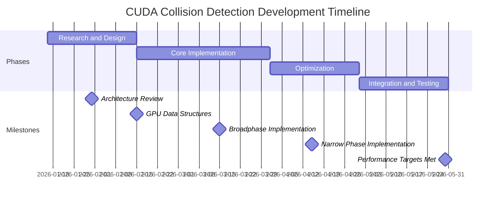

# CUDA Collision Detection System - Step-by-Step Development Plan

## Current Status: Planning Complete ✅

**Last Updated**: 2026-01-13
**Current Phase**: Ready for Implementation
**Next Milestone**: Phase 1 - Research and Design

## Overall Project Timeline



## Phase 1: Research and Design

### Checkpoint 1.1: Architecture Review
**Status**: ✅ Completed
**Tasks**:
- [x] Finalize overall system architecture
- [x] Review existing Bullet implementation
- [x] Identify integration points with Chrono
- [x] Document architecture decisions

### Checkpoint 1.2: GPU Data Structures
**Status**: ✅ Completed
**Tasks**:
- [x] Design AABB structure for GPU
- [x] Create contact point data layout
- [x] Develop manifold representation
- [x] Implement memory alignment strategies
- [x] Document data structure specifications

### Checkpoint 1.3: Algorithm Prototypes
**Status**: ✅ Completed
**Tasks**:
- [x] Implement CPU reference for broadphase grid algorithm
- [x] Create CPU reference for narrow phase algorithms
- [x] Develop test cases for algorithm validation
- [x] Benchmark reference implementations
- [x] Document algorithm specifications

**Deliverables**:
- Architecture documentation
- Data structure headers
- CPU reference implementations
- Test cases and benchmarks

## Phase 2: Core Implementation

### Checkpoint 2.1: CUDA Environment Setup
**Status**: ✅ Completed
**Tasks**:
- [x] Set up CUDA development environment
- [x] Configure project for CUDA compilation
- [x] Implement CUDA error handling utilities
- [x] Create CUDA device management system
- [x] Set up profiling tools (Nsight, nvprof)

### Checkpoint 2.2: Broadphase Implementation
**Status**: ✅ Completed
**Tasks**:
- [x] Implement GPU AABB data structures
- [x] Create spatial grid construction kernel
- [x] Develop broadphase collision detection kernel
- [x] Implement grid cell processing
- [x] Add overlap pair generation
- [x] Optimize memory access patterns
- [x] Test with various scene sizes

**Technical Details**:
```cpp
// Key implementation tasks:
1. GPU memory allocation for AABBs
2. Grid cell indexing and hashing
3. Parallel AABB overlap testing
4. Atomic operations for pair generation
5. Memory coalescing optimization
```

### Checkpoint 2.3: Narrow Phase Implementation
**Status**: ⏳ Pending
**Tasks**:
- [ ] Implement sphere-sphere collision kernel
- [ ] Develop box-box collision kernel
- [ ] Create capsule-capsule collision kernel
- [ ] Implement convex mesh collision detection
- [ ] Add contact point generation
- [ ] Optimize shape-type dispatch
- [ ] Test collision accuracy

**Shape Type Priority**:
1. Sphere-Sphere (Highest priority)
2. Box-Box
3. Sphere-Box
4. Capsule-Capsule
5. Convex-Convex

### Checkpoint 2.4: Memory Management
**Status**: ⏳ Pending
**Tasks**:
- [ ] Implement GPU memory pool
- [ ] Create pinned memory buffers
- [ ] Develop asynchronous data transfer
- [ ] Implement memory usage tracking
- [ ] Add error handling for OOM conditions
- [ ] Optimize memory allocation strategies

**Deliverables**:
- Functional broadphase collision detection
- Basic narrow phase collision algorithms
- Memory management system
- Initial performance benchmarks

## Phase 3: Optimization

### Checkpoint 3.1: Performance Profiling
**Status**: ⏳ Pending
**Tasks**:
- [ ] Profile broadphase kernel performance
- [ ] Analyze narrow phase bottlenecks
- [ ] Identify memory bandwidth issues
- [ ] Measure GPU occupancy
- [ ] Document performance baseline

### Checkpoint 3.2: Broadphase Optimization
**Status**: ⏳ Pending
**Tasks**:
- [ ] Optimize grid cell sizing
- [ ] Implement adaptive grid resolution
- [ ] Add workload balancing
- [ ] Optimize atomic operations
- [ ] Improve memory access patterns
- [ ] Add early exit conditions

**Optimization Targets**:
- 80%+ GPU occupancy
- <5% memory bandwidth waste
- Minimal atomic operation contention

### Checkpoint 3.3: Narrow Phase Optimization
**Status**: ⏳ Pending
**Tasks**:
- [ ] Optimize shape-type dispatch
- [ ] Implement batch processing
- [ ] Add contact point compaction
- [ ] Optimize mathematical operations
- [ ] Improve memory locality
- [ ] Add specialized algorithms for common cases

### Checkpoint 3.4: Memory Optimization
**Status**: ⏳ Pending
**Tasks**:
- [ ] Implement zero-copy memory where possible
- [ ] Add memory compression for geometry
- [ ] Optimize data transfer pipelines
- [ ] Implement out-of-core processing
- [ ] Add memory usage visualization
- [ ] Optimize cache utilization

**Deliverables**:
- Optimized collision detection system
- Performance analysis reports
- Memory usage optimization
- Benchmark comparisons with CPU version

## Phase 4: Integration and Testing

### Checkpoint 4.1: Chrono Integration
**Status**: ⏳ Pending
**Tasks**:
- [ ] Create CUDA collision system wrapper
- [ ] Implement Chrono interface compatibility
- [ ] Add fallback mechanism to CPU
- [ ] Develop hybrid CPU/GPU mode
- [ ] Implement error handling and recovery
- [ ] Add configuration options

**Integration Points**:
```cpp
// Key integration tasks:
1. ChCollisionSystem interface implementation
2. Memory synchronization between CPU/GPU
3. Fallback mechanism for unsupported cases
4. Configuration system for GPU/CPU selection
5. Error handling and recovery strategies
```

### Checkpoint 4.2: Comprehensive Testing
**Status**: ⏳ Pending
**Tasks**:
- [ ] Develop unit test suite
- [ ] Create integration test cases
- [ ] Implement performance regression tests
- [ ] Develop stress testing scenarios
- [ ] Create validation against CPU results
- [ ] Implement continuous integration tests

**Test Coverage**:
- Small scale (100-1000 objects)
- Medium scale (10,000-50,000 objects)
- Large scale (100,000+ objects)
- Various shape combinations
- Edge cases and boundary conditions

### Checkpoint 4.3: Performance Benchmarking
**Status**: ⏳ Pending
**Tasks**:
- [ ] Final performance testing
- [ ] Compare with original Bullet implementation
- [ ] Document performance improvements
- [ ] Create benchmark reports
- [ ] Identify remaining bottlenecks
- [ ] Final optimization pass

**Benchmark Metrics**:
- Frame rate / simulation speed
- Collision detection time breakdown
- Memory usage and bandwidth
- GPU utilization percentages
- Scalability with object count

**Deliverables**:
- Fully integrated collision system
- Comprehensive test suite
- Performance benchmark reports
- Documentation and user guides
- Final optimized implementation

## Detailed Task Breakdown by Week

### Week-by-Week Plan

| Week | Phase | Focus Area | Specific Tasks | Status |
|------|-------|------------|----------------|--------|
| 1 | Research | Architecture | Finalize architecture, review Bullet code | ✅ Complete |
| 2 | Research | Data Structures | Design GPU data layouts, create headers | ✅ Complete |
| 3-4 | Research | Algorithms | CPU references, test cases, validation | ✅ Complete |
| 5 | Core | Environment | CUDA setup, project configuration, utilities | ⏳ Pending |
| 6-8 | Core | Broadphase | Grid implementation, collision detection | ⏳ Pending |
| 9-11 | Core | Narrow Phase | Shape collision algorithms, contact generation | ⏳ Pending |
| 12 | Core | Memory | Memory management, data transfer system | ⏳ Pending |
| 13 | Optimization | Profiling | Performance analysis, bottleneck identification | ⏳ Pending |
| 14-15 | Optimization | Broadphase | Grid optimization, workload balancing | ⏳ Pending |
| 16 | Optimization | Narrow Phase | Algorithm optimization, batch processing | ⏳ Pending |
| 17-18 | Optimization | Memory | Zero-copy, compression, transfer optimization | ⏳ Pending |
| 19-20 | Integration | Chrono | Interface implementation, fallback mechanisms | ⏳ Pending |
| 21-23 | Integration | Testing | Unit tests, integration tests, validation | ⏳ Pending |
| 24 | Integration | Benchmarking | Final performance testing, documentation | ⏳ Pending |

## Key Checkpoints and Review Points

### Major Review Points

1. **Architecture Review (End of Week 1)**
   - Review overall system design
   - Validate integration approach
   - Approve data structure designs

2. **Algorithm Validation (End of Week 4)**
   - Verify CPU reference implementations
   - Validate test cases
   - Approve algorithm specifications

3. **Broadphase Implementation Review (End of Week 8)**
   - Functional broadphase collision detection
   - Performance baseline established
   - Memory access patterns validated

4. **Narrow Phase Implementation Review (End of Week 11)**
   - Core collision algorithms working
   - Contact generation validated
   - Shape-type dispatch optimized

5. **Optimization Review (End of Week 18)**
   - Performance targets met
   - Memory usage optimized
   - Bottlenecks identified and addressed

6. **Final Integration Review (End of Week 24)**
   - Full Chrono integration complete
   - Comprehensive test suite passing
   - Performance benchmarks documented
   - Ready for production use

## Resource Allocation

### Team Resources
- **CUDA Developer**: Primary implementation
- **Physics Engineer**: Algorithm validation
- **QA Engineer**: Testing and validation
- **Documentation**: API and user guides

### Hardware Requirements
- **Development**: CUDA-capable GPU (RTX 3080 or better)
- **Testing**: Multiple GPU configurations
- **CI/CD**: GPU-enabled build servers

### Software Dependencies
- CUDA Toolkit 12.x+
- NVIDIA Nsight for profiling
- Visual Studio / CMake build system
- Chrono physics engine integration

## Risk Management

### Identified Risks and Mitigation

1. **Performance Not Meeting Targets**
   - Mitigation: Early profiling, iterative optimization
   - Contingency: Hybrid CPU/GPU fallback

2. **Memory Constraints on Large Scenes**
   - Mitigation: Out-of-core processing, memory compression
   - Contingency: Adaptive quality settings

3. **Numerical Precision Issues**
   - Mitigation: Double precision where needed, validation tests
   - Contingency: CPU validation fallback

4. **Integration Complexity**
   - Mitigation: Clean interface design, comprehensive testing
   - Contingency: Gradual integration approach

## Success Criteria

### Technical Success Metrics
- **Performance**: 5-10x speedup over CPU for large scenes (>50,000 objects)
- **Accuracy**: <1% deviation from CPU collision results
- **Memory**: Efficient GPU memory usage with minimal overhead
- **Stability**: No crashes or memory leaks in extended testing

### Project Success Metrics
- **Timeline**: Complete within 24-week schedule
- **Quality**: Comprehensive test coverage (>90%)
- **Documentation**: Complete API and user documentation
- **Integration**: Seamless integration with Chrono physics system

## Next Steps

1. **Week 5**: Begin CUDA environment setup and configuration
2. **Week 6**: Start broadphase implementation with grid-based approach
3. **Week 9**: Begin narrow phase collision algorithm implementation
4. **Week 13**: Start performance profiling and optimization
5. **Week 19**: Begin Chrono integration and testing

The development plan provides a clear, step-by-step roadmap with well-defined checkpoints and deliverables at each stage, ensuring systematic progress toward the goal of GPU-accelerated collision detection.